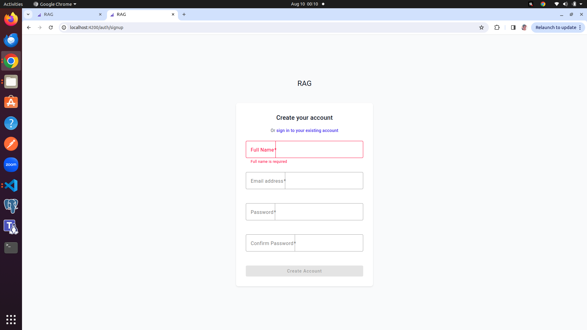
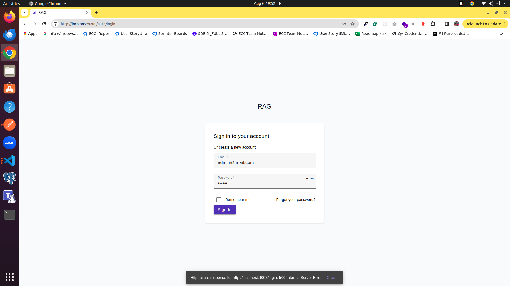
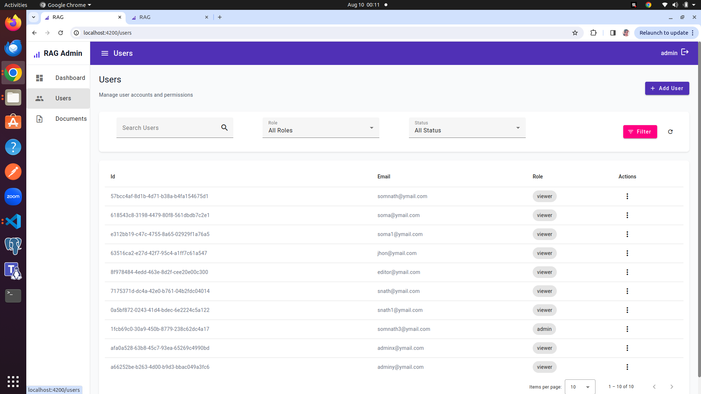
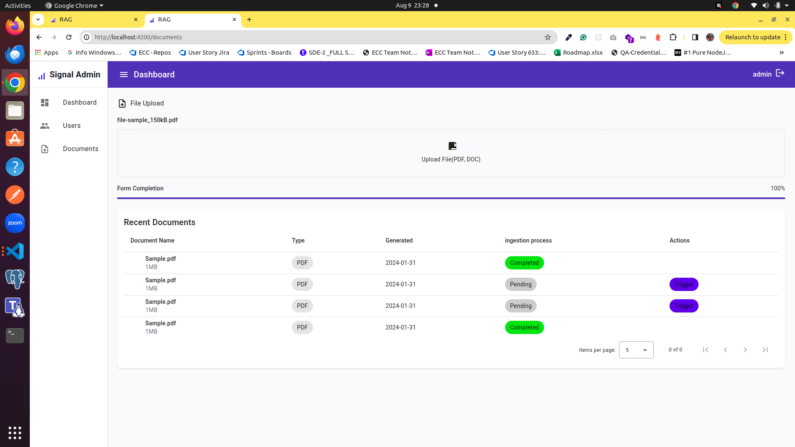

# RAG Panel


RAG admin panel built with Angular 20, Angular Material, and TailwindCSS. Features a responsive design with collapsible sidebar, user management, Upload documents and Manage documents 

## Project Structure

```
src/
├── app/
│   ├── core/
│   │   ├── models/          # Data models
│   │   ├── services/        # Core services
│   │   └── guards/          # Route guards
│   ├── features/
│   │   ├── dashboard/      # Dashboard feature
│   │   ├── user/           # User management
│   │   └── pages/          # Upload documents features
│   ├── layouts/
│   │   ├── auth-layout/    # Authentication layout
│   │   └── main-layout/    # Main app layout
│   ├── pages/
│   │   ├── login/          # Login page
│   │   └── signup/         # Signup page
│   └── shared/             # Shared components
├── assets/
│   └── mock-api/           # Mock API data
└── environments/           # Environment configs
```


### Prerequisites

- Node.js 20+
- npm or yarn

1. Install dependencies:

```bash
npm install
```

2. Start the development server:

```bash
npm start
```


The application will be available at `http://localhost:4200`







## Available Scripts

- `npm start` - Start development server
- `npm run build` - Build for production
- `npm run api` - Start json-server mock API
- `npm run test` - Run unit tests
- `npm run lint` - Run ESLint


## Deployment

1. Build the application:

```bash
npm run build
```

